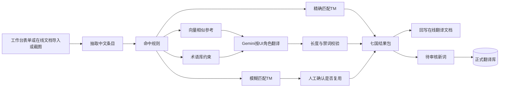
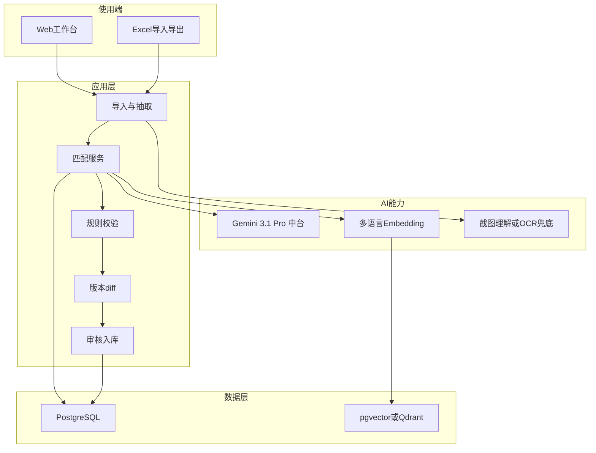

# App 多国语言翻译助手：需求方案文档

| 项目 | 内容 |
|---|---|
| 文档类型 | 产品需求 + 技术方案 |
| 适用对象 | 产品、运营、研发、AI 中台 |
| 源语言 | 中文（含义/文案） |
| 目标语言 | 英语、法语、德语、意大利语、波兰语、西班牙语、葡萄牙语 |
| 当前交付形态 | 在线翻译文档（中文一列 + 七国各一列），研发从该文档捞取 |
| 当前翻译动作 | 员工把中文意思复制到 AI 聊天模型，再把多语结果粘贴回在线文档 |
| 公司已有能力 | AI 中台，模型 Gemini 3.1 Pro |
| 文档状态 | 评审稿（完整版） |
| 一周落地 | 见 [一周最小可行方案.md](一周最小可行方案.md)，只解决一致性和 UI 长度 |

---

## 1. 背景与目标

海外 App 覆盖七个国家。员工做翻译时，以中文意思为源，分别产出英、法、德、意、波、西、葡译文。

**现状工作流（已确认）：**

1. 员工自行把中文意思复制到 AI 模型（各人提示词不同）。
2. 把模型返回的多种语言粘贴回在线翻译文档。
3. 研发再从该翻译文档中捞取文案进行开发。

由此出现两类反复问题：

1. **同一中文在不同员工、不同版本中译文不一致**，术语和常用按钮文案漂移（每人一套提示词，且结果不回写到统一库）。
2. **AI 不知道文案是按钮、标题还是正文**，译文长度经常超出控件，需要人工二次改文档。

本方案要替换的是中间那一步「复制到聊天模型再手工粘贴」，**不是**让员工在聊天框里多勾几个选项。在线翻译文档仍作为研发领取译文的出口。

本方案目标：

- 把已有 App 译文沉淀为可复用资产，减少重复翻译和口径分裂。
- 按 UI 角色（按钮/标题/正文等）约束译文长度与风格。
- 新词审核后入库，按 App 版本维护增量文档，研发仍从翻译文档捞取，开发方式不变。

非目标（本期不做）：

- 不替换研发 i18n 发版流水线（可后期对接 strings/xml/json）。
- 不做七国母语专业审校平台（可预留角色）。
- 不以「中文意思向量相近」自动合并或自动套用历史七国译文。

---

## 2. 结论

**原方案可以做，方向对，但不是最佳形态。**

三个核心诉求都成立：一致性、按 UI 类型控长度、按版本增量沉淀。需要改掉的是实现方式：

| 原方案做法 | 判断 | 推荐做法 |
|---|---|---|
| 一个翻译库 + 关键词/向量命中就复用七国译文 | 会把不同场景文案误合并 | 拆成 **术语库 + 翻译记忆（TM）**；向量只作相似参考 |
| PRD 截图标红作为主提取方式 | 不稳定，不能当主录入 | 工作台结构化提交 / 从在线文档导入为主，截图为辅 |
| 新词自动写入翻译库 | 会污染后续复用 | 必须 **待审核 → 通过后才进入正式库** |

推荐落地形态：

**术语库 + 翻译记忆（TM）+ 带 UI 约束的 AI 翻译 + 人工确认入库**

- 研发领取方式不变：仍从在线翻译文档捞取（也可导出 Excel）。
- 员工不再把中文复制进聊天模型；改为在工作台提交待译条目（或从文档导入），系统查库后再调用中台。
- 截图标红用于从 PRD 零散文案里批量抽取，抽取结果必须人工勾选确认。
- 公司 AI 中台（Gemini 3.1 Pro）适合「理解截图 + 按角色翻译」，**不适合单独承担检索和术语一致性**。

---

## 3. 问题本质

| 现象 | 根因 | 行业对应能力 |
|---|---|---|
| 同一中文在不同版本/不同人译文不一致 | 没有强制复用的术语库和翻译记忆 | Glossary + Translation Memory |
| AI 译文过长/过短，按钮装不下 | 缺少 UI 角色、长度上限、页面语境 | Context-aware MT + 长度校验 |
| 每次从零翻，无法沉淀 | 新词没有审核后回写，也没有版本增量 | TM 审核流 + 版本 diff |

关键语言约束：德语、波兰语通常比英文长 20%–40%。按钮、Tab、导航文案必须按角色限长，不能只按「意思对」验收。

---

## 4. 对原方案的详细评估

### 4.1 翻译库 + 关键词/向量匹配：要拆两层

**术语库（Glossary）**

- 管品牌名、功能名、状态词、活动名等必须统一的词。
- 例：「会员」「关注」「钱包」。
- 人工维护，优先级最高，命中后七国译法强制使用。
- 支持 do-not-translate（品牌、产品名、协议专名）。

**翻译记忆（TM）**

- 管完整 UI 句子/短语，必须带页面、控件类型、版本。
- 优先 **精确匹配**，其次 **模糊匹配**（标点、空格、轻微改写）。
- 同一中文、不同 UI 类型，视为不同条目，不得静默复用。

**向量检索**

- 只返回「相似历史」，供译员/模型参考。
- **禁止**因语义相近自动套用七国译文。
- 反例：「登录 / 立即登录 / 去登录」意思近，但按钮文案不同。

原方案风险：把「中文意思相近」当成「可复用译文」，会把标题、按钮、正文混成一条，表面解决了一致性，实际制造更难排查的错误复用。

### 4.2 截图标红提取：可做，但是辅路径

Gemini 多模态可以一次完成：识别标红区域、判断是否需翻译、分类控件、按长度约束出稿。但截图链路不稳定：

- 分辨率低、标红不闭合、箭头和圈混用。
- 设计稿上已经是英文/混排。
- 图标、数字、已有译文被当成源文案。
- 一行里中英混排，OCR 切句错误。

主路径要替换的是「复制中文到 AI 聊天框」，不是在聊天提示词后面加选项。

员工日常提交待译时，用工作台表单或从在线翻译文档导入，每条带上这些**字段**（不是 prompt）：

- 中文意思（必填，相当于现在复制进模型的那句话）
- UI 类型：按钮 / 标题 / 正文 等（下拉，用来控长度和语气）
- 页面名（可选，如登录页）
- 字数上限（可选；不填则按 UI 类型用默认上限）

系统先查术语库和翻译记忆：库里有就直接回填七国译文，员工不用再问 AI；库里没有才调用中台，并把 UI 类型等字段由后端写入 prompt。结果写回同一份在线翻译文档，研发捞取方式不变。

截图用于：PRD 里尚未写成中文条目的零散文案批量抽取。抽取后先出条目列表，人勾选确认，再进入上述流程。

### 4.3 新词自动入库：必须加审核

AI 译文直接进正式库，会把一次错译放大到后续所有版本。正确流程：

1. 未精确命中的条目进入 **待审核（draft）**。
2. 指定角色确认（产品/运营；可先中英双审）。
3. 状态改为 **approved** 后，才可被下次精确/模糊命中。
4. 按 App 版本写入增量记录。

---

## 5. 推荐方案

### 5.1 现状 vs 目标（员工侧）

现在员工做的是「自己当模型网关」：复制中文 → 自己写提示词 → 粘贴七国译文。目标是同一件事换入口，研发侧不变。

| 步骤 | 现在 | 目标 |
|---|---|---|
| 拿到中文意思 | 从 PRD / 需求里抄 | 不变，或从在线文档导入一列中文 |
| 告诉 AI 这是什么 | 写在聊天提示词里，或不写 | 工作台下拉选「按钮/标题/正文」 |
| 出七国译文 | 聊天模型一次性生成 | 先查翻译库，没有再调中台；prompt 由系统拼 |
| 写回文档 | 人工粘贴到在线翻译文档 | 一键回写/导出到同一份文档 |
| 研发 | 从翻译文档捞取 | 不变 |

日常最小操作可以是：在工作台粘贴一句中文 → 选「按钮」→ 点翻译 → 把结果同步回在线文档。这比现在少了「打开聊天、写提示词、复制七列」三步，并多了一个下拉，用来解决长度问题。

### 5.2 总流程

### 5.3 命中优先级（产品硬规则）

按以下顺序执行，前序命中则不再用后续结果自动填七国译文：

1. **术语库强制替换**（含 do-not-translate）。整句翻译时，句中术语必须按术语库译法嵌入。
2. **TM 精确匹配**：规范化后的中文完全一致。建议同时匹配 `ui_type`；类型不同则提示「同源不同场景」，不得静默套用。
3. **TM 模糊匹配**：相似度 ≥ 90%（可配置）。展示候选，人确认是否复用。
4. **向量相似 Top-K**：仅作参考，不自动填充七国译文。
5. **AI 生成**：注入 UI 类型、最大字符/行数、术语表、相似参考、目标语扩写系数。
6. **规则校验**：超长、漏译、术语未遵守、占位符 `{0}` / `%s` / `%d` 被破坏。
7. **导出与入库**：回写在线翻译文档（或导出 Excel）；未精确命中项进待审核；按版本生成增量。

规范化规则（精确/模糊匹配前必须执行）：

- 去除首尾空白，合并连续空格。
- 全角/半角标点统一（匹配用，展示仍保留原文）。
- 换行符统一为 `\n`。
- 不把数字、emoji、占位符从匹配键中删除（它们是文案的一部分）。

### 5.4 UI 角色与长度策略（默认，可配置）

| ui_type | 中文名 | 风格 | 默认长度策略 |
|---|---|---|---|
| `button` | 按钮 | 短词/短短语，动词优先 | 单行；英建议 ≤ 16 字符；德/波按 1.4 倍预警 |
| `tab` | Tab | 更短，名词优先 | 单行；英建议 ≤ 12 字符 |
| `nav` | 导航 | 短词 | 同 Tab |
| `title` | 标题 | 短语，可专名 | 单行；英建议 ≤ 28 字符 |
| `body` | 正文/说明 | 完整句子 | 可多行，不默认限长 |
| `toast` | Toast | 一句说完 | 1–2 行 |
| `error` | 错误提示 | 一句说完，语气明确 | 1–2 行 |
| `placeholder` | 输入占位 | 中短提示 | 单行 |
| `empty` | 空态 | 中短 | 1–2 行 |
| `legal` | 法律/协议 | 严谨，禁止意译品牌与条款用语 | 不限长 |

员工可在单条上覆盖 `char_limit` / `max_lines`。未填时用上表默认值。

扩写预警系数（相对英文长度，用于德/波等）：

| 语言 | 代码 | 相对英文扩写系数 |
|---|---|---|
| English | `en` | 1.00 |
| Français | `fr` | 1.20 |
| Deutsch | `de` | 1.35 |
| Italiano | `it` | 1.15 |
| Polski | `pl` | 1.30 |
| Español | `es` | 1.15 |
| Português | `pt` | 1.15 |

---

## 6. 产品需求

### 6.1 用户与场景

| 角色 | 主要动作 |
|---|---|
| 产品 / 运营 | 不再复制到聊天模型；在工作台提交中文+UI类型，或从在线文档导入；检查命中类型与超长警告；把结果写回/导出到翻译文档 |
| 审校（可先由产品兼任） | 确认新词入库；强制修订已 approved 条目 |
| 研发 | 一次性导出当前 App 全量多语言作为种子；后续仍从翻译文档捞取增量 |

### 6.2 功能清单

#### F1 翻译库建设

- 导入历史 Excel（兼容「中文 + 七国」列结构）。
- 导入研发资源文件（P1）：iOS `.strings` / `.xcstrings`、Android `strings.xml`、JSON/ARB。
- 去重：同一 `normalized_zh + ui_type` 只保留一条 approved 正文；冲突进人工合并队列。
- TM 与术语库分表，禁止混用。

#### F2 翻译工作台

- 单条录入（替换现有「复制到聊天模型」）：粘贴中文意思，下拉选择 UI 类型，可选填页面、字数上限，一点翻译。
- 从在线翻译文档 / Excel 导入待译批次（可只含中文列），绑定 App 版本号（如 `2.3.0`）。
- 截图（P1）：标红区域 → 模型抽取条目列表 → 人勾选确认 → 再翻译。
- 每条结果展示：
  - 命中类型：`exact` / `fuzzy` / `ai` / `mixed`（术语嵌入 + AI）
  - 七国译文
  - 超长/术语/占位符警告
  - 相似历史（Top-K，只读）
- 支持单语言手动改译；改译后该条标记为 `human_edited`。
- 一键回写在线翻译文档，或导出：
  - 本版本全量表
  - 本版本增量表（仅新增 + 中文变更）
  研发仍从该文档捞取，无需改开发习惯。

#### F3 增量与版本

- 以版本号为批次。相对上一版本计算：`added` / `changed` / `removed` / `unchanged`。
- 中文未变且已 approved：禁止改七国译文，除非走「强制修订」。
- 中文微调：走模糊匹配，提示是否沿用旧译。
- 废弃文案标记 `removed`，不从正式库物理删除（保留历史）。

#### F4 质量门禁

导出前或审核前提示（可配置为阻断/警告）：

- 空译、明显漏译（目标语言几乎等于源中文且非 do-not-translate）。
- 超字符 / 超行。
- 术语库未遵守。
- 占位符、数字、emoji、品牌名被改。
- 德/波等默认开启扩写预警。

#### F5 审核入库

- 精确命中且无人工改译：不进审核队列。
- 模糊命中经人确认复用：可直接 approved（记录确认人）。
- AI 新词 / 人工改译：默认 `draft`，审核通过后 `approved`。
- 审核驳回：保留译文草稿，不进入下次命中。

### 6.3 在线翻译文档 / Excel 列约定（与现有交付对齐）

**输入（待译，最小集）：**

| 列名 | 必填 | 说明 |
|---|---|---|
| 中文 | 是 | 源文案 |
| UI类型 | 否，强烈建议 | 无则默认 `body`，并在结果里标「未标注控件」 |
| 页面 | 否 | 如「登录页 / 会员中心」 |
| 字数上限 | 否 | 覆盖默认长度 |
| 备注 | 否 | 给模型/审校的语境 |

**输出（给研发）：**

| 列名 | 说明 |
|---|---|
| 中文 | 源文案 |
| English | en |
| Français | fr |
| Deutsch | de |
| Italiano | it |
| Polski | pl |
| Español | es |
| Português | pt |
| UI类型 | 回写，便于下次导入 |
| 页面 | 回写 |
| 命中类型 | exact / fuzzy / ai / mixed |
| 校验结果 | OK / 超长 / 术语冲突 等 |
| 版本 | App 版本 |
| 变更类型 | added / changed / unchanged（增量表中无 unchanged） |

增量表不含 `unchanged` 行。全量表含全部本版本条目。

---

## 7. 数据模型

### 7.1 术语库 `glossary`

| 字段 | 类型 | 说明 |
|---|---|---|
| id | uuid | 主键 |
| term_zh | string | 中文术语 |
| en, fr, de, it, pl, es, pt | string | 强制译法 |
| translatable | bool | false 表示保持原文（品牌等） |
| case_sensitive | bool | 默认 false |
| note | string | 使用场景 |
| status | enum | draft / approved / deprecated |
| updated_at | datetime | |

匹配时对源中文做最长术语优先替换，避免「会员中心」被短词「会员」先切错。

### 7.2 翻译记忆 `tm_entry`

| 字段 | 类型 | 说明 |
|---|---|---|
| id | uuid | 主键 |
| source_zh | string | 原始中文 |
| normalized_zh | string | 规范化中文，匹配键 |
| en, fr, de, it, pl, es, pt | string | 七国译文 |
| ui_type | enum | 见 5.3 |
| page | string | 页面/模块 |
| char_limit | int? | 单条覆盖上限 |
| max_lines | int? | |
| placeholders | json | 从源文提取的 `{0}`、`%s` 等 |
| status | enum | draft / approved / deprecated |
| source | enum | human / ai / imported |
| first_version | string | 首次入库版本 |
| last_version | string | 最近出现版本 |
| embedding | vector | 仅用于相似参考 |
| created_at / updated_at | datetime | |
| approved_by / approved_at | | 审核信息 |

唯一约束建议：`(normalized_zh, ui_type)` 在 `status=approved` 下唯一。

### 7.3 批次 `translation_batch`

| 字段 | 说明 |
|---|---|
| id | 主键 |
| app_version | 如 2.3.0 |
| base_version | 对比用上一版本 |
| created_by | |
| status | processing / ready / exported |
| input_type | excel / form / screenshot |

### 7.4 批次条目 `batch_item`

| 字段 | 说明 |
|---|---|
| batch_id | |
| source_zh | |
| ui_type / page / char_limit | |
| match_type | exact / fuzzy / ai / mixed |
| tm_entry_id | 命中或将写入的条目 |
| translations | 七国 JSON |
| warnings | 校验警告列表 |
| change_type | added / changed / removed / unchanged |
| review_status | pending / approved / rejected |
| screenshot_id / bbox | 截图来源时填写 |

### 7.5 版本增量 `tm_version_diff`

记录某版本相对上一版本的 added / changed / removed，用于导出增量表和审计。

---

## 8. 技术方案

### 8.1 逻辑架构

职责划分：

- **匹配、术语、长度、占位符**：应用层规则，不交给模型「自觉」。
- **截图理解、控件分类、未命中条目的多语生成**：Gemini 3.1 Pro。
- **相似参考**：独立 embedding + 向量库，与聊天模型解耦。

### 8.2 用公司 AI 中台（推荐主路径）

| 能力 | 建议 | 说明 |
|---|---|---|
| 截图理解 + 控件分类 + 按角色翻译 | Gemini 3.1 Pro | 一次多模态即可 |
| 术语一致性 | 不靠模型记忆 | 检索出术语/TM 后注入 prompt |
| 精确/模糊匹配 | 应用层 | 规范化中文 + 编辑距离（Levenshtein / 归一化相似度） |
| 向量相似 | 多语言 embedding + 向量库 | 中欧混合检索；与 Gemini 解耦 |
| 长度校验 | 规则引擎 | 按语言和 ui_type |

模糊匹配建议：对 `normalized_zh` 计算 `1 - distance / max(len_a, len_b)`，阈值默认 0.90。候选最多 5 条，按分数降序。

向量检索建议：

- 模型：支持中文 + 英法德意波西葡的多语言 embedding（如 BGE-M3 / multilingual-e5）。
- Top-K 默认 5。
- 过滤：仅检索 `status=approved`。
- 返回字段给模型：source_zh、ui_type、page、对应语言译文。只作 few-shot 参考。

### 8.3 Prompt 约束（AI 翻译）

每次调用必须注入，且要求 **只返回 JSON**，禁止解释性前后文：

- `ui_type`、`max_chars`、`max_lines`
- 命中的术语表（中文 → 七国强制译法 / do-not-translate）
- TM 精确/模糊命中（若有）
- 向量相似参考（若有）
- 占位符列表，要求原样保留
- 目标语扩写系数
- 输出 schema：七国字段 + `ui_type_detected`（截图场景）+ `need_translate`（截图场景）

截图抽取与翻译应拆成两步（推荐）：

1. **抽取**：输出候选条目（原文、是否需译、建议 ui_type、bbox）。
2. **人确认后翻译**：只对勾选条目调用翻译，避免把图标/数字当源文。

若中台时延或费用敏感，翻译可按批次打包（一次 20–50 条），但仍按条做匹配与校验。

### 8.4 不用公司 AI 中台时的路径

工作台、库结构、匹配优先级不变，只替换「生成」和「截图理解」供应商。

| 路径 | 适用 | 做法 | 代价 |
|---|---|---|---|
| A. 公有多模态 API | 最快验证 | OpenAI GPT-4o / Anthropic Claude / Google Gemini 官方 API，仅换模型网关 | 合规、密钥、数据出境需评估 |
| B. 专业 TMS | 最省自研 | Lokalise / Crowdin / Phrase：自带 TM、术语库、截图语境、版本、Excel 与 iOS/Android 文件；欧语可用 DeepL，控件分类仍可用 LLM | 订阅费用；流程迁到外部工具 |
| C. 开源自建 | 数据不出域 | Weblate 或 Tolgee 做 TM；DeepL 做欧语；PaddleOCR 做截图；BGE-M3 + Qdrant/pgvector 做相似检索 | 工程量大 |
| D. 本地模型 | 强隔离 | 中文理解/截图用 Qwen-VL；欧语短按钮质量不稳定，仍建议 DeepL 或云端模型 | 显卡与运维成本 |

无论是否用中台，检索层都应自建或使用 TMS 自带 TM：**精确匹配 > 模糊匹配 > 向量参考**。不要把「找历史」和「生成译文」绑死在同一次大模型调用里。

欧语补充：DeepL 在法/德/意/波/西/葡的短句和正式语体上，通常优于通用 LLM 的裸翻。若走路径 B/C，建议 **术语与 TM 命中用规则，未命中欧语用 DeepL，中文语境与控件分类用 LLM**。

### 8.5 建议技术栈（自研内部工具）

| 层 | 建议 |
|---|---|
| 前端 | Web 工作台：上传 Excel/截图、审核、导出、警告列表 |
| 后端 | 导入解析、匹配服务、版本 diff、导出、中台网关 |
| 存储 | PostgreSQL（条目 + 版本 + 审核） |
| 向量 | pgvector 或独立 Qdrant |
| Embedding | 多语言模型（中文 + 七国） |
| LLM | 公司中台 Gemini 3.1 Pro |
| OCR 兜底 | 截图以 Gemini 为主；失败时 PaddleOCR + 红色区域规则框选 |

Excel 解析/导出建议使用稳定库（如 Python `openpyxl`），列名做别名映射，兼容「English / 英语 / en」等历史表头。

### 8.6 接口草案（自研时）

仅列核心能力，供研发评估工作量，不绑定具体框架。

**`POST /api/import/excel`**

- 入参：文件、`app_version`、`base_version`
- 出参：`batch_id`、条目数、无法解析行

**`POST /api/import/screenshot`**

- 入参：图片、可选「标红表示待译」说明
- 出参：候选条目列表（原文、ui_type 建议、need_translate、bbox）
- 下一步：`POST /api/batches/{id}/confirm-extract` 提交勾选结果

**`POST /api/batches/{id}/translate`**

- 对批次执行匹配 + 必要时 AI 翻译 + 校验
- 出参：每条 match_type、translations、warnings

**`GET /api/batches/{id}/items`**

- 工作台列表，支持按警告、命中类型过滤

**`POST /api/reviews/{item_id}`**

- approve / reject / force-revise
- approve 时写入或更新 `tm_entry`

**`GET /api/export/{batch_id}?type=full|delta`**

- 返回 Excel

**`POST /api/glossary/import`**、**`GET /api/tm/search`**

- 术语维护与人工查询

中台调用由后端统一封装，前端不直连模型。日志需记录 prompt 版本、模型名、耗时、条目 id，便于审计，禁止把完整密钥写入日志。

---

## 9. 种子数据与治理

上线前准备：

1. 研发导出当前 App 全量七国文案（Excel 或资源文件）。
2. 回灌历史翻译 Excel。
3. 人工整理核心术语 **100–300 条**（品牌、会员体系、支付、权限、高频按钮）。
4. 导入后全部标记 `source=imported`，`status=approved`（视为历史已上线口径）。
5. 冲突（同一中文同一 ui_type 多译）进入合并队列，由产品选定一条为正式译法。

治理规则：

- 只有 `approved` 可被精确/模糊命中。
- 术语变更需记录原因，变更后下一批次才生效，不回溯已导出文件。
- 强制修订必须填写原因，并生成 `changed` 增量。

---

## 10. 分期

### P0（先解决主痛点）

- 库结构：术语库 + TM
- Excel 导入导出（兼容现有列）
- 精确匹配 + 模糊匹配
- 手动选择 UI 类型后的 AI 翻译（中台 Gemini）
- 待审核入库
- 版本全量 / 增量表

P0 即可降低「同一词各版本不一致」和「按钮过长要二次改文档」的发生频率。

### P1（体验与覆盖）

- 截图标红抽取（人确认后翻译）
- 长度门禁与扩写预警写入工作台
- 向量相似参考
- 研发资源文件导入（strings / xml / json）

### P2（加深集成）

- 对接 iOS/Android 资源回写
- DeepL 欧语增强（可选，即使仍用中台也可混用）
- 独立审校角色与权限
- 与 AI 中台用量、配额、审计对齐

截图是体验加速，不是正确性前提。没有 P1 截图，P0 用 Excel + UI 类型下拉已经能跑通主流程。

---

## 11. 验收标准

| 编号 | 验收项 | 通过标准 |
|---|---|---|
| A1 | 精确复用 | 已入库且 approved 的中文 + 相同 UI 类型，复用率 100%，七国与库内逐字一致 |
| A2 | 术语强制 | 术语库命中项，七国强制译法不得被模型改写；do-not-translate 保持原文 |
| A3 | 长度门禁 | 按钮/Tab 超长必须标红或阻断，不能静默通过导出 |
| A4 | 审核隔离 | 新词默认不进正式库；未审核条目不能被后续批次精确命中 |
| A5 | 增量正确 | 增量表只含新增和中文变更（及强制修订）；未变更条目只出现在全量表 |
| A6 | 占位符 | `{0}`、`%s`、`%d`、`%@` 数量与顺序与源文一致 |
| A7 | 截图抽取（P1） | 必须人工确认列表；允许漏抽；不允许把图标、纯数字、已译英文当作中文源并自动入库 |
| A8 | 同源不同场景 | 同一中文、不同 ui_type，系统提示差异，不自动套用另一类型译文 |
| A9 | 导出兼容 | 导出 Excel 可被现有研发流程直接使用（七国列齐全） |
| A10 | 中台故障降级 | 中台不可用时，精确/模糊命中仍可导出；仅 AI 新词失败并明确报错，不得写空译进正式库 |

---

## 12. 风险与对策

| 风险 | 影响 | 对策 |
|---|---|---|
| 向量误合并 | 错误复用按钮/标题 | 向量永不自动填译文 |
| 截图误抽 | 脏数据入库 | 抽取与翻译分步，人确认 |
| AI 德/波过长 | 二次改文档依旧发生 | 规则引擎限长 + 扩写系数，超长打回或给短译候选 |
| 历史 Excel 口径冲突 | 种子库不唯一 | 导入冲突队列，产品裁定 |
| 无 UI 类型的旧表 | 匹配过粗 | 无类型时默认 body，并提示补标；精确匹配优先同类型 |
| 中台限流 | 大批量版本卡住 | 批次打包、可重试、命中库的条目不走模型 |
| 数据出境合规 | 公有 API 路径不可用 | 默认走公司中台；路径 A 需法务评估 |

---

## 13. 工作量粗估（供排期，非承诺）

按 1–2 名后端 + 1 名前端估算：

| 阶段 | 范围 | 粗估 |
|---|---|---|
| P0 | 库、Excel、匹配、中台翻译、审核、版本导出 | 3–5 周 |
| P1 | 截图、长度门禁工作台化、向量、资源文件导入 | 2–4 周 |
| P2 | 资源回写、DeepL、权限与审计 | 视对接深度 2–6 周 |

若优先验证价值、减少自研：可先用路径 B（Crowdin/Lokalise）跑通术语 + TM + Excel，再决定是否自建工作台。自研的核心差异是「按现有 Excel 习惯 + 中文源 + 公司中台 + UI 类型门禁」更贴当前团队。

---

## 14. 决策建议

1. **做内部工具，而不是只写一份更大的 Excel。** 一致性依赖库和规则，不依赖员工记忆。
2. **P0 用 Excel + UI 类型 + TM/术语库 + 审核**；截图放到 P1。
3. **生成用公司 Gemini 中台，检索不要用 Gemini。** 精确/模糊/术语在应用层完成。
4. **未命中才调用模型；命中必须回放历史译文。**
5. **不用中台时，优先评估 TMS（Lokalise/Crowdin）或 DeepL + 自建 TM**，而不是用另一个聊天模型从头生成全部七国文案。

本方案确认后即可进入 P0 详细设计与接口联调，不依赖先做截图能力。
